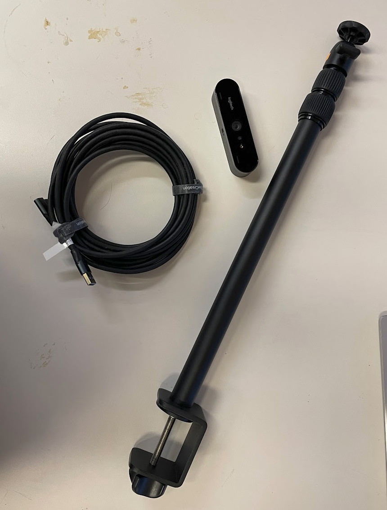
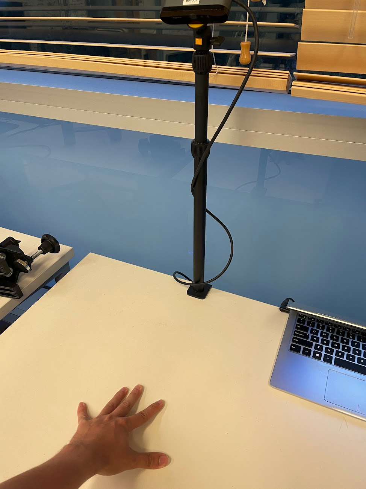
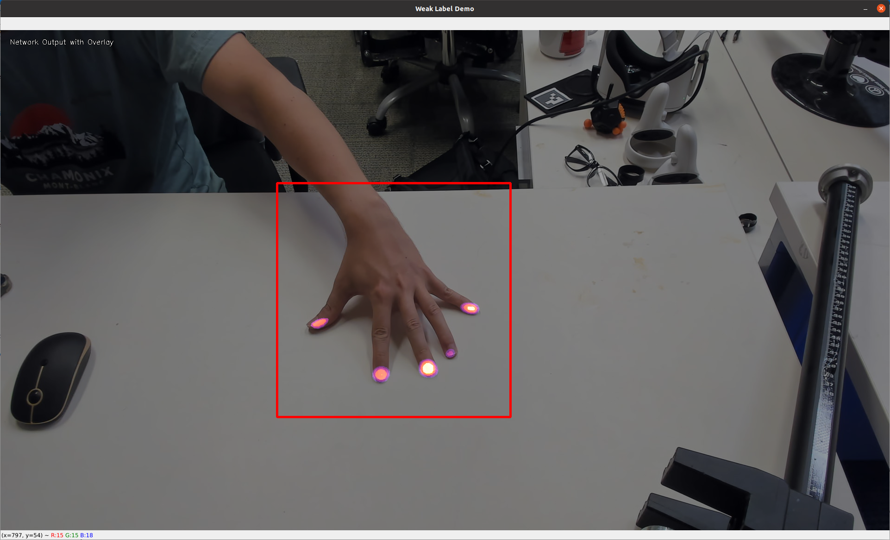

# PressureVision++: Estimating Fingertip Pressure from Diverse RGB Images
Patrick Grady, Jeremy A. Collins, Chengcheng Tang, Christopher D. Twigg, Kunal Aneja, James Hays, Charles C. Kemp

[[Paper]](https://pressurevision.github.io/pressurevision2.pdf) [[Video]](https://www.youtube.com/watch?v=MPHPIWfp7Bg) [[Website]](https://pressurevision.github.io/)


## Installation

First, create a new conda environment.
```
conda create -n pv2 python=3.11
conda activate pv2
```

Install PyTorch with CUDA support. As installation is highly dependent on your setup, we refer to the [official PyTorch website](https://pytorch.org/). 

Install the `segnentation-models-pytorch` project. This must be done by cloning from git.
```
git clone https://github.com/qubvel/segmentation_models.pytorch
pip install -e segmentation_models.pytorch/
```

Clone this repo and install the requirements.
```
git clone https://github.com/pgrady3/pressurevision2.git
cd pressurevision2
pip install -r requirements.txt
```

To download the model checkpoint, follow this link and create a `data` and `model` folder such that the file resides in `data/model/paper_29.pth`

[https://www.dropbox.com/scl/fi/0r2koefy7bhr66dffc8z7/paper_29.pth?rlkey=wshcxm8iy8l1qo60oo7khdqjp&dl=0](https://www.dropbox.com/scl/fi/0r2koefy7bhr66dffc8z7/paper_29.pth?rlkey=wshcxm8iy8l1qo60oo7khdqjp&dl=0)

Unfortunately, our team is still working on dataset hosting. As a result, the release of the dataset is slightly delayed, and training and evaluation is not possible at this time.

## Common commands

To render results from the trained model on the test set:
```
python -m prediction.make_network_movie --config paper
```

To train a model:
```
python -m prediction.trainer --config paper
```

To generate the paper's evaluation metrics:
```
python -m prediction.evaluator --config paper
```

To visualize a random sequence from the dataset
```
python -m recording.view_sequence
```

## Running the webcam demo

To run the demo:

```
python -m prediction.demo_webcam --config paper
```

While simply running the demo is easy, there are a few steps recommended to achieve the best results. We recommend assembling the following parts. This specific model of webcam is well-tested, but you can use any model.

* Logitech Brio 4k webcam. [Amazon Link](https://www.amazon.com/Logitech-Calling-Noise-Canceling-Correction-Microsoft/dp/B01N5UOYC4)
* Table camera mount. [Amazon Link](https://www.amazon.com/Camera-Adjustable-Tabletop-Streaming-Shooting/dp/B09W5CRYZ3?th=1)
* Long USB C-to-A cable. [Amazon Link](https://www.amazon.com/CableCreation-Compatible-Virtual-Reality-Headsets/dp/B08RMLWVL6)



Next, set up the hardware. The system works well when illuminated by indoor lighting, and the camera is mounted ~55cm above the table, pointing down at a roughly 45 degree angle, as pictured.



Finally, run the demo script.

